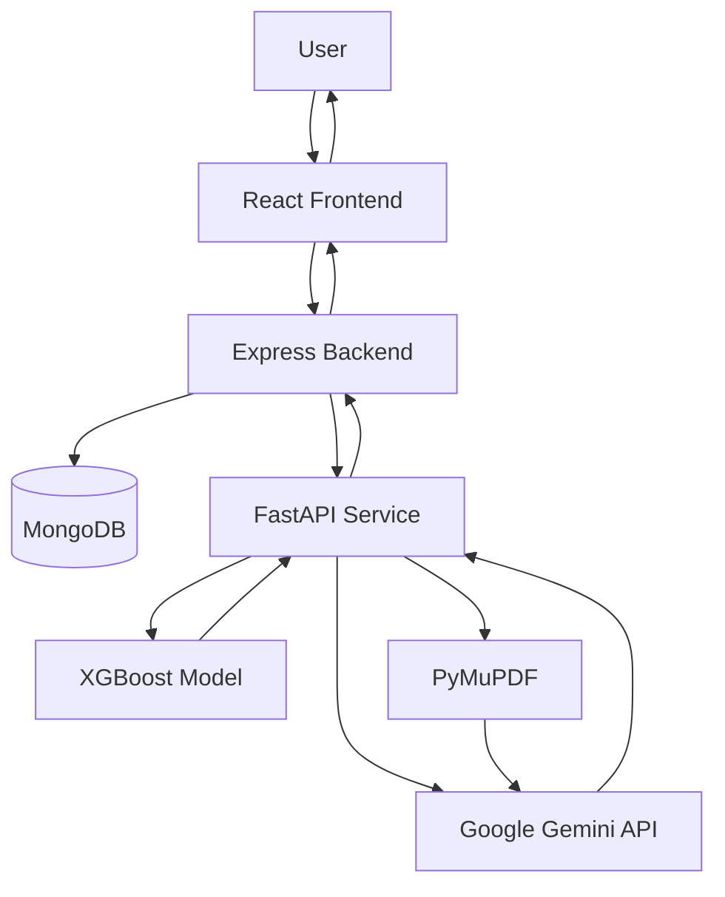

# HealthMonitor — AI-Powered Health Monitoring System

<p align="center">
  <strong>An AI-assisted platform for cardiovascular risk prediction, personalized health information, and prescription analysis.</strong>
</p>

<p align="center">
  <a href="https://github.com/siamarefin/HealthMonitor">GitHub Repository</a> •
  <a href="https://github.com/siamarefin">Author</a> •
  <a href="https://siamarefin.github.io/">Portfolio</a>
</p>

---

## Overview

**HealthMonitor** is a full-stack, AI-powered health monitoring web application designed to make health-related information and preliminary risk assessment more accessible through an interactive web interface.

The system integrates machine learning, generative AI, and document processing into a unified application. Users can submit health indicators for cardiovascular risk prediction, ask health-related questions through an AI-powered conversational interface, and upload prescription PDFs to extract and interpret their text using a large language model.

The application follows a modular architecture consisting of a React frontend, a Node.js and Express backend, a MongoDB database, and a Python-based FastAPI service for machine learning and AI functionalities.

### Key Objectives

* Provide preliminary cardiovascular risk prediction using machine learning.
* Offer conversational access to general health information through generative AI.
* Enable users to ask questions about prescription documents.
* Support user registration, login, and feedback submission.
* Deliver an accessible, interactive interface for health-related tasks.

> **Disclaimer:** HealthMonitor is an experimental academic software project. Its predictions and AI-generated responses are not medical diagnoses or a substitute for professional medical advice. Always consult a qualified healthcare professional for medical decisions.

---

## Features

### 1. Cardiovascular Risk Prediction

HealthMonitor integrates a trained XGBoost classification model to estimate cardiovascular risk from user-provided health indicators.

**Input features:**

* Systolic blood pressure (`ap_hi`)
* Diastolic blood pressure (`ap_lo`)
* Cholesterol level (`cholesterol`)
* Age in years (`age_years`)
* Body mass index (`bmi`)

The React frontend collects the required inputs and sends them to the Express backend. The backend forwards the request to the FastAPI prediction service, which loads the trained model and returns a binary classification result.

**Technologies:** Python, XGBoost, Pandas, Joblib, FastAPI, Scikit-learn-compatible model interface.

### 2. AI-Powered Health Advice

The application provides a conversational interface for health-related questions, powered by Google's Gemini 2.0 Flash model through LangChain.

Users can:

* Submit health-related questions in a chat interface.
* Receive AI-generated explanations and general health information.
* View formatted responses using Markdown.
* Continue conversations through a chat-style interface.

The React application sends questions to the Express API, which forwards them to the FastAPI service. The service invokes the Gemini model and returns the generated response.

**Technologies:** Google Gemini 2.0 Flash, LangChain, FastAPI, React, React Markdown.

### 3. Prescription PDF Analysis

HealthMonitor includes an AI-powered prescription analysis feature that allows users to upload a PDF document and ask questions about its contents.

**Workflow:**

1. Upload a prescription PDF through the web interface.
2. Enter a question or instruction about the document.
3. The FastAPI service extracts text from the PDF using PyMuPDF.
4. The extracted text and user's question are passed to the Gemini model.
5. The AI-generated response is displayed in the frontend.

The feature supports text-based PDF extraction. Scanned documents that contain only images may require OCR, which is not currently implemented.

**Technologies:** Python, FastAPI, PyMuPDF, LangChain, Google Gemini, React Markdown.

### 4. User Authentication

The application includes user registration and login functionality.

**Implemented capabilities:**

* User registration with name, email, and password.
* Password hashing using bcrypt.
* Password verification during login.
* MongoDB-based user information storage.
* Duplicate email checking during registration.

Google OAuth dependencies and commented-out integration code are present, but a complete, active Google OAuth login flow is not currently implemented.

**Technologies:** Node.js, Express, MongoDB, Mongoose, bcryptjs.

### 5. User Feedback System

The feedback module allows users to submit feedback or questions through a dedicated form.

**Collected information:**

* User email
* Feedback or question
* Age
* Submission timestamp

The backend verifies that the submitted email belongs to a registered user before saving feedback to MongoDB.

### 6. Interactive Health Dashboard

The home page provides a health-oriented interface with visual sections related to:

* Fitness and gym tracking
* Food and nutrition
* Blood pressure
* Medication reminders
* Water intake
* Heart rate
* Sleep statistics
* Health information and emergency contacts

The current dashboard primarily provides a visual interface and informational sections; it does not yet implement live wearable-device integration or persistent tracking of all these health metrics.

---

## System Architecture

HealthMonitor uses a modular, multi-service architecture to separate user interaction, API management, machine learning, and generative AI processing.



### Architecture Components

| Component           | Responsibility                                                    | Technology        |
| ------------------- | ----------------------------------------------------------------- | ----------------- |
| Frontend            | User interface, forms, chat, and results                          | React             |
| Backend             | API routing, authentication, database access, service integration | Node.js, Express  |
| Database            | User accounts and feedback storage                                | MongoDB           |
| ML Service          | Cardiovascular risk prediction                                    | FastAPI, XGBoost  |
| Generative AI       | Health advice and document-based responses                        | Gemini, LangChain |
| Document Processing | PDF text extraction                                               | PyMuPDF           |

### Request Flow

1. The user interacts with the React application.
2. The frontend sends an HTTP request to the Express backend or, for prescription analysis, directly to FastAPI.
3. Express handles authentication, feedback, and requests for predictions and health advice.
4. FastAPI processes prediction requests, AI prompts, or uploaded prescription documents.
5. The relevant model or external AI service generates a response.
6. The response is returned to the frontend and displayed to the user.

---

## Technology Stack

| Category            | Technologies                            |
| ------------------- | --------------------------------------- |
| Frontend            | React 19, React Router, Axios, CSS      |
| Backend             | Node.js, Express 5                      |
| Database            | MongoDB, Mongoose                       |
| Machine Learning    | XGBoost, Pandas, Joblib                 |
| AI / LLM            | Google Gemini 2.0 Flash, LangChain      |
| API Framework       | FastAPI, Pydantic                       |
| Document Processing | PyMuPDF                                 |
| Authentication      | bcryptjs                                |
| File Handling       | FastAPI UploadFile, Multipart Form Data |
| Development Tools   | npm, Nodemon, Uvicorn, Git              |

---

## Project Structure

```text
HealthMonitor/
│
├── backend/
│   ├── server.js
│   ├── code.py
│   ├── package.json
│   ├── package-lock.json
│   ├── requirements.txt
│   └── XGBoostClassifier_model.pkl
│
├── client/
│   ├── public/
│   │   ├── index.html
│   │   ├── manifest.json
│   │   └── [Health-related images and assets]
│   │
│   ├── src/
│   │   ├── App.js
│   │   ├── App.css
│   │   ├── index.js
│   │   ├── index.css
│   │   │
│   │   └── components/
│   │       ├── Advice.jsx
│   │       ├── Body.jsx
│   │       ├── Feedback.jsx
│   │       ├── Footer.jsx
│   │       ├── Header.jsx
│   │       ├── HealthCheck.jsx
│   │       ├── Login.jsx
│   │       ├── Navbar.jsx
│   │       ├── Prescription.jsx
│   │       ├── Signup.jsx
│   │       │
│   │       └── styles/
│   │           ├── Advice.css
│   │           ├── Body.css
│   │           ├── Feedback.css
│   │           ├── Footer.css
│   │           ├── Header.css
│   │           ├── HealthCheck.css
│   │           ├── Navbar.css
│   │           ├── Prescription.css
│   │           └── Signup.css
│   │
│   └── package.json
│
├── models/
│   └── XGBoostClassifier_model.pkl
│
├── HealthMonitorReport.docx
├── package.json
├── package-lock.json
└── README.md
```

---

## Installation and Setup

### Prerequisites

Ensure the following software is installed:

* Node.js (LTS recommended)
* npm
* Python 3.10 or later
* pip
* MongoDB Atlas account or a local MongoDB instance
* Google Gemini API key

### 1. Clone the Repository

```bash
git clone https://github.com/siamarefin/HealthMonitor.git

cd HealthMonitor
```

### 2. Configure the Backend

```bash
cd backend
npm install
```

Configure the MongoDB connection using an environment variable such as `MONGODB_URI`. The current backend has a hardcoded MongoDB connection string, so update `server.js` to read from the environment before running the application.

Create a `.env` file in the `backend` directory:

```env
MONGODB_URI=your_mongodb_connection_string
```

Update the database connection in `server.js` to use `process.env.MONGODB_URI` and avoid committing credentials to GitHub.

### 3. Configure the Python Environment

From the `backend` directory:

```bash
python3 -m venv myenv

source myenv/bin/activate
```

On Windows:

```powershell
myenv\Scripts\activate
```

Install the dependencies:

```bash
pip install -r requirements.txt

pip install xgboost langchain-google-genai
```

The additional packages are needed by the current machine learning and Gemini implementation but are not all listed in the existing `requirements.txt`.

### 4. Configure the Gemini API

Add the following variable to the `backend/.env` file:

```env
GEMINI_API_KEY=your_google_gemini_api_key
```

The FastAPI application loads this environment variable to initialize the Gemini model.

Never commit API keys, database passwords, or other credentials to version control.

### 5. Start the FastAPI Service

From the `backend` directory, with the virtual environment activated:

```bash
uvicorn code:app --reload --port 8000
```

The API will be available at:

```text
http://localhost:8000
```

Interactive API documentation:

```text
http://localhost:8000/docs
```

Ensure the trained model is available at the path expected by `backend/code.py`:

```text
../models/XGBoostClassifier_model.pkl
```

### 6. Start the Express Backend

Open a separate terminal:

```bash
cd HealthMonitor/backend

npm start
```

The Express server runs at:

```text
http://localhost:5000
```

### 7. Start the React Frontend

Open another terminal:

```bash
cd HealthMonitor/client

npm install

npm start
```

The frontend will be available at:

```text
http://localhost:3000
```

The React development server uses a proxy configured to forward API requests to the Express backend.

### 8. Access the Application

Open the following URL in your browser:

```text
http://localhost:3000
```

You can now explore the available pages, register an account, submit health indicators for prediction, ask health-related questions, and analyze prescription PDFs.

---

## API Documentation

### Express Backend

| Method | Endpoint        | Description                            |
| ------ | --------------- | -------------------------------------- |
| POST   | `/api/register` | Register a new user                    |
| POST   | `/api/login`    | Authenticate an existing user          |
| POST   | `/api/predict`  | Request cardiovascular risk prediction |
| POST   | `/api/advice`   | Request AI-generated health advice     |
| POST   | `/api/feedback` | Submit user feedback                   |

### FastAPI Service

| Method | Endpoint        | Description                                      |
| ------ | --------------- | ------------------------------------------------ |
| POST   | `/predict`      | Generate an ML-based prediction                  |
| POST   | `/advice`       | Generate AI health information                   |
| POST   | `/prescription` | Analyze a prescription PDF and answer a question |
| GET    | `/docs`         | Interactive API documentation                    |

### Example: Cardiovascular Prediction

**Request**

`POST /api/predict`

```json
{
  "ap_hi": 120,
  "ap_lo": 80,
  "cholesterol": 1,
  "age_years": 35,
  "bmi": 23.5
}
```

**Response**

```json
{
  "input": {
    "ap_hi": 120,
    "ap_lo": 80,
    "cholesterol": 1,
    "age_years": 35,
    "bmi": 23.5
  },
  "predicted_cardio": 0
}
```

The `predicted_cardio` field is the binary model output. Its interpretation depends on the training labels and validation of the model; it should not be considered a clinical diagnosis.

### Example: AI Health Advice

**Request**

`POST /api/advice`

```json
{
  "question": "What is the importance of maintaining healthy blood pressure?"
}
```

**Response**

```json
{
  "answer": "A generated response from the AI service."
}
```

### Example: Prescription Analysis

**Request**

`POST /prescription`

Use `multipart/form-data` with:

* `file`: An optional PDF document.
* `message`: The user's question about the document.

**Response**

```json
{
  "response": "An AI-generated answer based on the extracted document text."
}
```

---

## Machine Learning Methodology

HealthMonitor uses a trained XGBoost classification model for cardiovascular risk prediction.

### Model Inputs

| Feature       | Description                           |
| ------------- | ------------------------------------- |
| `ap_hi`       | Systolic blood pressure               |
| `ap_lo`       | Diastolic blood pressure              |
| `cholesterol` | Cholesterol category or encoded value |
| `age_years`   | Age in years                          |
| `bmi`         | Body mass index                       |

The model is loaded using Joblib and receives the user input as a Pandas DataFrame. It generates a binary prediction that is returned through the FastAPI endpoint.

### Prediction Pipeline

```text
User Health Indicators
          |
          v
     React Form
          |
          v
    Express API
          |
          v
     FastAPI
          |
          v
   Input DataFrame
          |
          v
  Trained XGBoost Model
          |
          v
   Binary Prediction
          |
          v
     User Interface
```

The repository contains the trained model artifact. Detailed training data, feature preprocessing, hyperparameter selection, model evaluation metrics, and independent clinical validation are not established by the inspected application code and should be documented separately if available.

---

## Database Design

The backend uses MongoDB with Mongoose schemas.

### User Collection

| Field      | Type   | Description            |
| ---------- | ------ | ---------------------- |
| `name`     | String | User's name            |
| `email`    | String | Unique user email      |
| `password` | String | Bcrypt-hashed password |

### Feedback Collection

| Field       | Type   | Description             |
| ----------- | ------ | ----------------------- |
| `email`     | String | Registered user's email |
| `feedback`  | String | Feedback or question    |
| `age`       | Number | User's age              |
| `createdAt` | Date   | Submission timestamp    |

Cardiovascular predictions are processed by the ML service but are not currently persisted in the database by the inspected backend code.

---

## User Interface

The React frontend provides dedicated pages for the application's major functions.

| Page         | Route           | Purpose                               |
| ------------ | --------------- | ------------------------------------- |
| Home         | `/`             | Health dashboard and project overview |
| Login        | `/login`        | User login                            |
| Signup       | `/signup`       | User registration                     |
| Health Check | `/health-check` | Cardiovascular risk prediction        |
| Feedback     | `/feedback`     | Submit feedback                       |
| AI Advice    | `/advice`       | Conversational AI interface           |
| Prescription | `/prescription` | Prescription document analysis        |

The interface uses reusable React components and separate CSS files to organize page layouts and styling.

---

## Security and Privacy Considerations

HealthMonitor processes potentially sensitive health information and documents. The current repository is a development-oriented implementation and requires additional security work before deployment with real patient data.

Recommended improvements include:

* Move all database credentials and API keys into environment variables.
* Rotate any credentials that have previously been committed to the repository.
* Implement secure session or token-based authentication.
* Enforce server-side validation for all user inputs.
* Add rate limiting and request-size restrictions.
* Restrict CORS to trusted origins in production.
* Secure PDF uploads with file-type verification, size limits, and safe handling.
* Add authorization checks to protect user-specific information.
* Avoid logging sensitive health data or personally identifiable information.
* Use HTTPS and an appropriate data-retention policy.
* Review applicable privacy and healthcare data regulations before handling real patient records.

The current login implementation does not provide a complete production-grade session or authorization system.

---

## Limitations

* The cardiovascular prediction model provides experimental binary outputs and is not clinically validated by the application code.
* AI-generated health advice may contain inaccurate or incomplete information.
* Prescription analysis relies on extractable PDF text and does not currently include OCR for scanned prescriptions.
* The dashboard's health tracking sections are primarily visual and are not connected to live medical devices.
* Prediction history is not currently stored.
* Google OAuth is not fully enabled.
* Production deployment, comprehensive automated testing, and production security controls require further development.

---

## Future Improvements

Potential directions for extending HealthMonitor include:

* **Advanced Machine Learning:** Evaluate additional classification algorithms and deep learning approaches, with rigorous validation and transparent reporting.
* **Explainable AI:** Integrate model interpretability methods such as SHAP to help explain prediction outputs.
* **Medical Image Analysis:** Explore deep learning for selected medical imaging tasks with appropriate datasets and validation.
* **Personalized Health Monitoring:** Add longitudinal health records, trend analysis, and user-controlled tracking.
* **Wearable Integration:** Explore integration with compatible fitness trackers and health devices.
* **Enhanced Document Intelligence:** Add OCR and more structured prescription information extraction.
* **Secure Authentication:** Introduce robust authentication, authorization, and account management.
* **Data Visualization:** Add interactive charts and historical health summaries.
* **Deployment:** Prepare containerized services and a secure cloud deployment workflow.
* **Testing and CI/CD:** Add unit, integration, security, and model evaluation tests.

These are potential extensions rather than features currently confirmed in the implementation.

---

## Running the Application

For local development, start each service in a separate terminal:

**Terminal 1 — FastAPI**

```bash
cd backend
source myenv/bin/activate
uvicorn code:app --reload --port 8000
```

**Terminal 2 — Express**

```bash
cd backend
npm start
```

**Terminal 3 — React**

```bash
cd client
npm start
```

Ensure MongoDB and the required environment variables are configured before starting the services.

---

## Author

**Siam Arefin**

B.Sc. in Software Engineering
Shahjalal University of Science and Technology (SUST), Bangladesh

* **GitHub:** [@siamarefin](https://github.com/siamarefin)
* **LinkedIn:** [Siam Arefin](https://www.linkedin.com/in/siam-arefin/)
* **Portfolio:** [siamarefin.github.io](https://siamarefin.github.io/)

---

## License

The existing README identifies this project as MIT-licensed. Verify that a `LICENSE` file is present in the repository and that its terms match before distributing the project under that license.

---

## Acknowledgments

This project brings together open-source software and AI technologies, including React, Node.js, Express, MongoDB, FastAPI, XGBoost, LangChain, PyMuPDF, and Google's Gemini API.

---

<p align="center">
  <strong>HealthMonitor</strong><br/>
  AI-assisted health monitoring, predictive analytics, and document intelligence.
</p>
